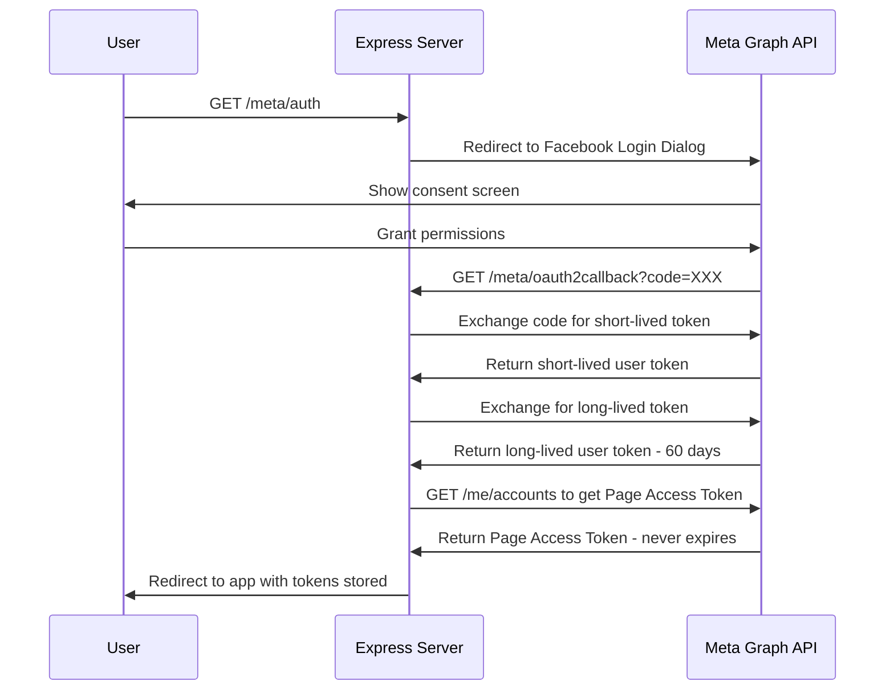
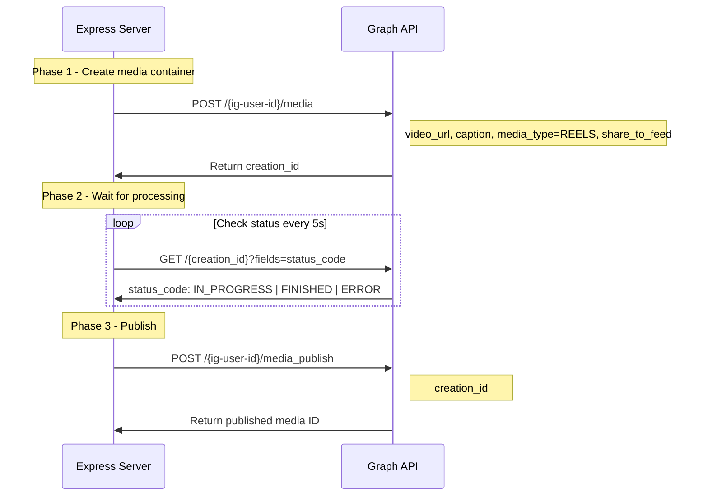
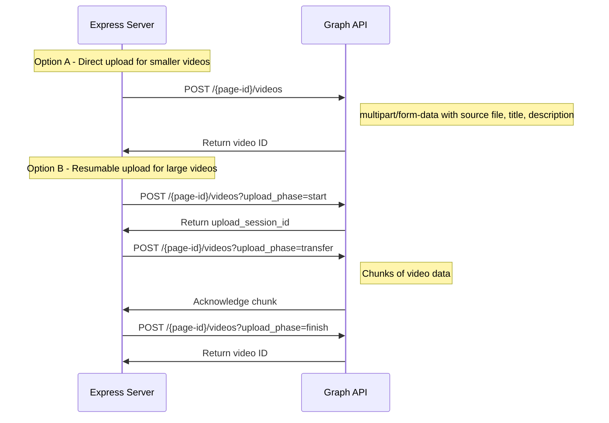

# Instagram & Facebook Integration Plan

## 1. Overview

Extend the existing YouTube-only Social Media Uploader to support **Instagram Reels** and **Facebook Page video posts**, with full scheduling parity (smart scheduling, bulk upload, configuration save/load).

Both Instagram and Facebook use the **Meta Graph API**, so they share a single OAuth flow and SDK integration.

---

## 2. Current Architecture Summary

```
src/
├── config/
│   ├── google.ts          # Google OAuth2 client + YouTube API instance
│   └── multer.ts          # File upload config
├── middleware/
│   ├── auth.ts            # Google token refresh middleware
│   └── logging.ts         # Request logging
├── routes/
│   ├── auth.ts            # Google OAuth flow (/auth, /oauth2callback)
│   ├── upload.ts          # YouTube upload + schedule endpoints
│   └── videoStats.ts      # YouTube video stats
├── services/
│   ├── authService.ts     # Google token refresh logic
│   └── youtubeService.ts  # YouTube upload, stats, schedule cache
├── utils/
│   ├── engagementRate.ts  # Engagement calculation
│   └── logger.ts          # Logging utility
├── public/
│   ├── index.html         # Single-page UI (YouTube-only)
│   ├── main.js            # Form logic, config management
│   ├── scheduling-logic.js # Smart scheduling algorithm
│   └── style.css          # Styles
└── index.ts               # Express app entry point
```

**Key patterns to follow:**
- Service layer handles API calls (e.g., `youtubeService.ts`)
- Routes handle HTTP request/response (e.g., `upload.ts`)
- Config files initialize API clients (e.g., `google.ts`)
- Auth middleware refreshes tokens before protected routes
- Frontend is vanilla JS with no framework

---

## 3. Meta Graph API Architecture

### 3.1 Authentication Flow



**Required permissions/scopes:**
- `pages_manage_posts` — Post to Facebook Pages
- `pages_read_engagement` — Read Page insights
- `instagram_basic` — Read Instagram account info
- `instagram_content_publish` — Publish to Instagram
- `pages_show_list` — List user Pages

### 3.2 Instagram Reels Upload Flow

Instagram Reels upload uses a **two-phase** process via the Graph API:



**Important constraints:**
- Video must be hosted at a **public URL** (not direct file upload)
- We need to either: (a) temporarily host the video on our server with a public URL, or (b) upload to a cloud storage first
- **Recommended approach**: Serve uploaded files temporarily via Express static route, use ngrok/public URL in dev, or upload to cloud storage in production
- Max video duration: 15 minutes for Reels
- Supported formats: MP4, MOV
- Aspect ratio: 9:16 recommended for Reels

### 3.3 Facebook Page Video Post Flow

Facebook supports **direct file upload** (resumable upload for large files):



**Scheduling support:**
- Facebook supports `scheduled_publish_time` (Unix timestamp) natively
- Video must be set to `published=false` with `scheduled_publish_time`
- Instagram does NOT support native scheduling — we would need to store scheduled posts and use a cron/timer to publish at the right time

### 3.4 Scheduling Strategy

| Platform | Native Scheduling | Our Approach |
|----------|------------------|--------------|
| YouTube | Yes - `publishAt` field | Already implemented |
| Facebook | Yes - `scheduled_publish_time` | Use native API scheduling |
| Instagram | No | Option A: Upload immediately, no scheduling. Option B: Build a job queue with node-cron to publish at scheduled times |

**Recommended for v1**: Instagram uploads immediately (no scheduling), Facebook uses native scheduling. Scheduling for Instagram can be added later with a job queue.

---

## 4. New File Structure

```
src/
├── config/
│   ├── google.ts           # (existing) Google OAuth2
│   ├── meta.ts             # NEW - Meta Graph API client setup
│   └── multer.ts           # (update) Add image extensions
├── middleware/
│   ├── auth.ts             # (existing) Google auth
│   ├── metaAuth.ts         # NEW - Meta token validation/refresh
│   └── logging.ts          # (existing)
├── routes/
│   ├── auth.ts             # (existing) Google OAuth
│   ├── metaAuth.ts         # NEW - Meta OAuth flow
│   ├── upload.ts           # (existing) YouTube upload
│   ├── instagramUpload.ts  # NEW - Instagram Reels upload
│   ├── facebookUpload.ts   # NEW - Facebook Page video upload
│   └── videoStats.ts       # (existing) YouTube stats
├── services/
│   ├── authService.ts      # (existing) Google token refresh
│   ├── metaAuthService.ts  # NEW - Meta token exchange/refresh
│   ├── youtubeService.ts   # (existing)
│   ├── instagramService.ts # NEW - Instagram Reels upload logic
│   └── facebookService.ts  # NEW - Facebook video upload logic
├── public/
│   ├── index.html          # (update) Multi-platform UI
│   ├── main.js             # (update) Platform-aware form logic
│   ├── scheduling-logic.js # (existing) Reusable as-is
│   └── style.css           # (update) New platform styles
└── index.ts                # (update) Register new routes
```

---

## 5. Detailed Implementation Steps

### Step 1: Dependencies & Configuration

**New dependency:** `axios` for Meta Graph API calls (lightweight, no heavy SDK needed)

**`src/config/meta.ts`** — Initialize Meta API configuration:
- Export `META_APP_ID`, `META_APP_SECRET`, `META_REDIRECT_URI` from env
- Export helper for building Graph API URLs
- Export `getGraphApiUrl(path, params)` utility

**`.env.example`** additions:
```
META_APP_ID=your_meta_app_id
META_APP_SECRET=your_meta_app_secret
META_REDIRECT_URI=http://localhost:3001/meta/oauth2callback
META_USER_ACCESS_TOKEN=your_long_lived_user_token
META_PAGE_ID=your_facebook_page_id
META_PAGE_ACCESS_TOKEN=your_page_access_token
INSTAGRAM_BUSINESS_ACCOUNT_ID=your_ig_business_account_id
```

### Step 2: Meta Authentication

**`src/services/metaAuthService.ts`**:
- `exchangeCodeForToken(code)` — Exchange auth code for short-lived token
- `getLongLivedToken(shortLivedToken)` — Exchange for 60-day token
- `getPageAccessToken(userToken)` — Get never-expiring Page token
- `getInstagramBusinessAccountId(pageId, pageToken)` — Get linked IG account
- `refreshLongLivedToken(token)` — Refresh before expiry

**`src/middleware/metaAuth.ts`**:
- Check if Meta tokens exist in env/memory
- Validate token is not expired
- Auto-refresh if needed
- Pattern mirrors existing `auth.ts` middleware

**`src/routes/metaAuth.ts`**:
- `GET /meta/auth` — Redirect to Facebook Login Dialog
- `GET /meta/oauth2callback` — Handle callback, exchange tokens, store Page token and IG account ID

### Step 3: Instagram Service

**`src/services/instagramService.ts`**:
- `uploadReel(videoUrl, caption, options)`:
  1. Create media container via `POST /{ig-user-id}/media`
  2. Poll status via `GET /{creation_id}?fields=status_code` every 5 seconds
  3. Publish via `POST /{ig-user-id}/media_publish`
  4. Return published media ID and permalink
- `getMediaInsights(mediaId)` — Get views, likes, comments for a Reel
- Video URL handling: Serve uploaded file temporarily via Express static route

### Step 4: Facebook Service

**`src/services/facebookService.ts`**:
- `uploadPageVideo(file, metadata)`:
  - For files < 1GB: Direct upload via `POST /{page-id}/videos` with multipart form
  - For files >= 1GB: Resumable upload (start → transfer chunks → finish)
  - Support `scheduled_publish_time` for scheduling
  - Support `title`, `description` metadata
- `getVideoInsights(videoId)` — Get video stats
- `getScheduledPosts(pageId)` — Fetch scheduled posts for conflict checking

### Step 5: Upload Routes

**`src/routes/instagramUpload.ts`**:
- `POST /instagram/upload` — Accept video files, upload as Reels
  - Uses multer for file handling
  - Temporarily serves file for Instagram to fetch
  - Calls `instagramService.uploadReel()`
  - Cleans up temp files after upload
- `GET /instagram/media-stats/:mediaId` — Get Reel insights

**`src/routes/facebookUpload.ts`**:
- `POST /facebook/upload` — Accept video files, post to Page
  - Uses multer for file handling
  - Calls `facebookService.uploadPageVideo()`
  - Supports `scheduled_publish_time` from form
  - Cleans up temp files
- `GET /facebook/existing-schedule` — Fetch scheduled Page posts
- `GET /facebook/video-stats/:videoId` — Get video insights

### Step 6: Express App Updates

**`src/index.ts`** changes:
- Import and register `metaAuthRouter` at `/meta`
- Import and register `instagramUploadRouter` with `metaAuthMiddleware`
- Import and register `facebookUploadRouter` with `metaAuthMiddleware`
- Serve uploaded files temporarily at `/temp-media/` for Instagram URL requirement

### Step 7: Frontend Updates

**Platform selector** — Add tabs or dropdown at the top:
- YouTube | Instagram | Facebook
- Show/hide platform-specific sections based on selection

**Auth section** — Show relevant auth button:
- YouTube: "Authenticate with YouTube" (existing)
- Instagram/Facebook: "Authenticate with Meta" (new)

**Upload form changes**:
- Platform-specific fields appear based on selection
- Instagram: Caption (instead of title+description), share_to_feed toggle, cover image upload
- Facebook: Title, Description, scheduled_publish_time
- YouTube: Existing fields (unchanged)

**Scheduling integration**:
- The existing `scheduling-logic.js` is platform-agnostic (it just generates dates)
- Facebook: Pass scheduled dates as `scheduled_publish_time` to API
- Instagram: Show dates but note "Instagram does not support scheduling - videos will upload immediately"
- YouTube: Existing behavior unchanged

**Multi-platform upload** (future enhancement):
- Allow selecting multiple platforms and uploading the same video to all

---

## 6. API Endpoints Summary

| Method | Path | Description | Auth |
|--------|------|-------------|------|
| GET | `/meta/auth` | Start Meta OAuth flow | None |
| GET | `/meta/oauth2callback` | Meta OAuth callback | None |
| POST | `/instagram/upload` | Upload Instagram Reel | Meta |
| GET | `/instagram/media-stats/:id` | Get Reel insights | Meta |
| POST | `/facebook/upload` | Upload Facebook Page video | Meta |
| GET | `/facebook/existing-schedule` | Get scheduled FB posts | Meta |
| GET | `/facebook/video-stats/:id` | Get FB video insights | Meta |
| GET | `/auth` | (existing) Google OAuth | None |
| GET | `/oauth2callback` | (existing) Google callback | None |
| POST | `/upload` | (existing) YouTube upload | Google |
| GET | `/existing-schedule` | (existing) YouTube schedule | Google |
| GET | `/video-stats/:id` | (existing) YouTube stats | Google |

---

## 7. Key Technical Decisions

1. **Use `axios` instead of Meta SDK** — The `facebook-nodejs-business-sdk` is heavy and poorly maintained. `axios` with the Graph API REST endpoints is simpler and more maintainable.

2. **Instagram video URL requirement** — Instagram requires a publicly accessible video URL. For local development, we will serve files via Express and require the user to expose their server (e.g., via ngrok). For production, a cloud storage upload step can be added later.

3. **No Instagram scheduling in v1** — Instagram Graph API does not support scheduled publishing. This would require a persistent job queue (e.g., Bull + Redis), which is out of scope for v1. Videos will upload immediately.

4. **Facebook native scheduling** — Facebook supports `scheduled_publish_time` natively, so we use it directly.

5. **Shared scheduling algorithm** — The existing `scheduling-logic.js` generates dates independently of the platform. It can be reused as-is for Facebook scheduling and for displaying planned dates for Instagram (even if they upload immediately).

6. **Separate routes per platform** — Rather than a single `/upload` endpoint with a platform parameter, separate routes keep the code clean and allow platform-specific middleware.

---

## 8. Environment Variables

```env
# Existing (Google/YouTube)
CLIENT_ID=your_google_client_id
CLIENT_SECRET=your_google_client_secret
REDIRECT_URI=http://localhost:3001/oauth2callback
REFRESH_TOKEN=your_google_refresh_token

# New (Meta/Facebook/Instagram)
META_APP_ID=your_meta_app_id
META_APP_SECRET=your_meta_app_secret
META_REDIRECT_URI=http://localhost:3001/meta/oauth2callback
META_USER_ACCESS_TOKEN=your_long_lived_user_token
META_PAGE_ID=your_facebook_page_id
META_PAGE_ACCESS_TOKEN=your_page_access_token
INSTAGRAM_BUSINESS_ACCOUNT_ID=your_ig_business_account_id
PUBLIC_BASE_URL=http://localhost:3001
```

`PUBLIC_BASE_URL` is needed for Instagram Reels upload — the video must be accessible at a public URL.

---

## 9. Risk & Limitations

| Risk | Mitigation |
|------|------------|
| Instagram requires public video URL | Serve via Express + require ngrok for local dev |
| Instagram has no scheduling API | Document limitation; upload immediately in v1 |
| Meta token expiry (60 days for user token) | Page tokens never expire; user tokens auto-refresh |
| Rate limits on Graph API | Add retry logic with exponential backoff |
| Video processing delay on Instagram | Poll with timeout; show progress to user |
| Large video uploads to Facebook | Use resumable upload for files > 1GB |
